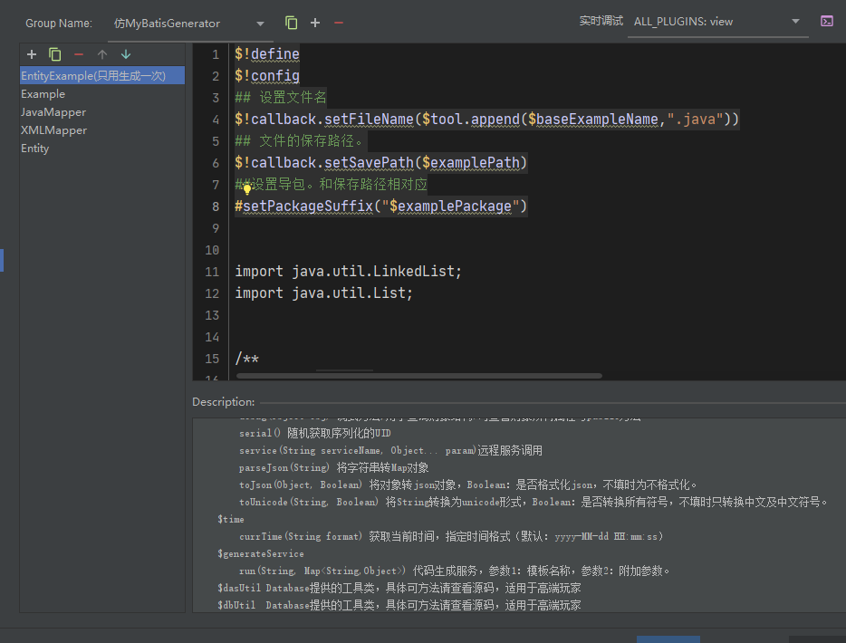
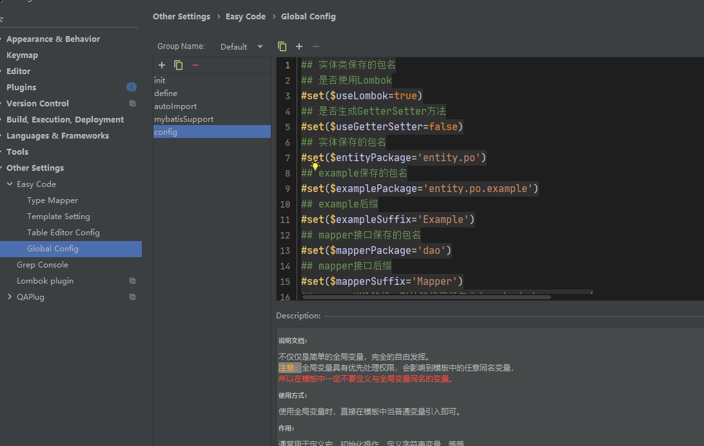

# 说明

+ 只支持单主键或者无主键。多个主键需要自己写。
+ 模板仿照MyBatis-Generator自动生成的模板，并且在其中加入了一些优化
+ 需要导入模板和全局配置文件，具体配置参考配置文件中的说明
+ 配置项目：

```vm
## 是否使用Lombok
#set($useLombok=true)
## 是否生成GetterSetter方法
#set($useGetterSetter=false)
## 实体保存的包名
#set($entityPackage='entity.po')
## example保存的包名
#set($examplePackage='entity.po.example')
## example后缀
#set($exampleSuffix='Example')
## mapper接口保存的包名
#set($mapperPackage='dao')
## mapper接口后缀
#set($mapperSuffix='Mapper')
## mapperXMl路径：默认路径已经包含/src/main/resources/
#set($mapperXMLPath='mapper')
## 是否生成Example(只是会指示是否生成Example相关方法，具体是否生成Example还是看是否勾选了Example)
#set($useExample=true)
## 是否添加selectSelective方法(会根据填入的字段选择指定内容。为了提高性能没使用枚举类，请通过约定来约束)，前提是必须开启了useExample
#set($selectSelective=true)
## 是否在Example中添加Column内部类，记录所有表字段
#set($createColumn=true)
```


# 导入

+ `Entity.vm`、`EntityExample.vm`、`Example.vm`、`JavaMapper.vm`、`XmlMapper.vm`需要导入到Template Setting中。如下图：
  + 
+ `config.vm`需要导入到Global config中（**注：由于用到了默认的几个全局文件，所以最好不要创建新的模板，直接在默认的模板添加**）。如下图：
  + 

# 生成代码

## 测试表

```sql
create table user
(
	id bigint unsigned auto_increment
		primary key,
	account varchar(100) null,
	password varchar(100) null
);
```

## 生成的实体类

```java
package cn.gloduck.onlinetest.entity.po;

import lombok.AllArgsConstructor;
import lombok.Data;
import lombok.NoArgsConstructor;

import java.io.Serializable;

/**
 * (User)实体类
 *
 * @author Gloduck
 * @since 2020-12-08 11:28:23
 */

@NoArgsConstructor
@AllArgsConstructor
@Data
public class User implements Serializable {
    private static final long serialVersionUID = -28183071851891684L;

    private Long id;

    private String account;

    private String password;


}
```

## 生成的BaseExample

```java
package cn.gloduck.onlinetest.entity.po.example;


import java.util.LinkedList;
import java.util.List;


/**
 * @author Gloduck
 */
public class EntityExample {
    /**
     * 排序条件
     */
    protected String orderByClause;

    /**
     * 是否倒序
     */
    protected boolean desc;

    /**
     * 条件列表
     */
    protected List<Criteria> criterias;

    /**
     * 选择列列表
     */
    protected List<String> selectColumns;

    /**
     * 当前正在操作的条件
     */
    protected Criteria currentCriteria;

    /**
     * 是否去重
     */
    protected boolean distinct;

    /**
     * 限制量
     */
    protected Integer limit;
    /**
     * 偏移量
     */
    protected Long offset;


    public EntityExample() {
        this.criterias = new LinkedList<>();
    }


    /**
     * 创建一个新的条件列表
     *
     * @return
     */
    public EntityExample newCriteria() {
        Criteria criteria = new Criteria();
        this.criterias.add(criteria);
        this.currentCriteria = criteria;
        return this;
    }

    /**
     * 创建一个新的条件列表
     *
     * @return
     */
    public EntityExample or() {
        return newCriteria();
    }

    /**
     * 设置限制量
     *
     * @param limit
     * @return
     */
    public EntityExample setLimit(Integer limit) {
        this.limit = limit;
        return this;
    }

    /**
     * 设置起始量
     *
     * @param offset
     * @return
     */
    public EntityExample setOffset(Long offset) {
        this.offset = offset;
        return this;
    }

    /**
     * 设置是否唯一
     *
     * @param distinct
     * @return
     */
    public EntityExample setDistinct(boolean distinct) {
        this.distinct = distinct;
        return this;
    }

    /**
     * 设置当前页数
     *
     * @param current
     * @param perPage
     * @return
     */
    public EntityExample setPage(Integer current, Integer perPage) {
        if (current == null || current < 1 || perPage == null || perPage < 1) {
            throw new IllegalArgumentException("Argument invalid");
        }
        long offset = (current.longValue() - 1) * perPage;
        this.offset = offset;
        this.limit = perPage;
        return this;
    }

    /**
     * 设置是否倒序
     *
     * @return
     */
    public EntityExample setOrderByDesc() {
        this.desc = true;
        return this;
    }

    /**
     * 设置排序条件
     *
     * @param clauses
     * @return
     */
    public EntityExample setOrderByClause(String... clauses) {
        if (clauses != null) {
            StringBuilder builder = new StringBuilder();
            builder.append("order by ");
            int length = clauses.length - 1;
            for (int i = 0; i < length; i++) {
                builder.append(clauses[i]);
                builder.append(" , ");
            }
            builder.append(clauses[length]);

            this.orderByClause = builder.toString();
        }
        return this;
    }

    public EntityExample addStringCondition(String condition) {
        if (currentCriteria == null) {
            newCriteria();
        }
        this.currentCriteria.addCondition(condition);
        return this;
    }

    public EntityExample addStringCondition(String condition, Object value) {
        if (currentCriteria == null) {
            newCriteria();
        }
        this.currentCriteria.addCondition(condition, value);
        return this;
    }

    public EntityExample addStringCondition(String condition, Object firstValue, Object secondValue) {
        if (currentCriteria == null) {
            newCriteria();
        }
        this.currentCriteria.addCondition(condition, firstValue, secondValue);
        return this;
    }

    /**
     * 添加选择列名，如果为null默认选择所有
     *
     * @param columns
     * @return
     */
    public EntityExample addSelectColumn(String... columns) {
        if (selectColumns == null) {
            this.selectColumns = new LinkedList<>();
        }
        for (int i = 0; i < columns.length; i++) {
            selectColumns.add(columns[i]);
        }
        return this;
    }


    protected class Criteria {
        protected List<Condition> conditions;

        public boolean isValid() {
            return conditions.size() > 0;
        }

        public Criteria() {
            this.conditions = new LinkedList<>();
        }

        public void setConditions(List<Condition> conditions) {
            this.conditions = conditions;
        }

        public void getConditions(List<Condition> conditions) {
            this.conditions = conditions;
        }

        protected void addCondition(String condition) {
            if (condition == null) {
                throw new IllegalArgumentException("condition can't be null");
            }
            this.conditions.add(new Condition(condition));
        }

        protected void addCondition(String condition, Object value, String typeHandler) {
            if (value == null) {
                throw new IllegalArgumentException("value can't be null");
            }
            this.conditions.add(new Condition(condition, value, typeHandler));
        }

        protected void addCondition(String condition, Object value) {
            if (value == null) {
                throw new IllegalArgumentException("value can't be null");
            }
            this.conditions.add(new Condition(condition, value));
        }

        protected void addCondition(String condition, Object firstValue, Object secondValue, String typeHandler) {
            if (firstValue == null || secondValue == null) {
                throw new IllegalArgumentException("value can't be null");
            }
            this.conditions.add(new Condition(condition, firstValue, secondValue, typeHandler));
        }

        protected void addCondition(String condition, Object firstValue, Object secondValue) {
            if (firstValue == null || secondValue == null) {
                throw new IllegalArgumentException("value can't be null");
            }
            this.conditions.add(new Condition(condition, firstValue, secondValue));
        }

        @Override
        public String toString() {
            return "Criteria{" +
                    "conditions=" + conditions +
                    '}';
        }
    }

    protected static class Condition {
        protected static int NO_VALUE = 0;
        protected static int SINGLE_VALUE = 1;
        protected static int DOUBLE_VALUE = 2;
        protected static int LIST_VALUE = 3;
        /**
         * where条件
         */
        private final String condition;
        /**
         * 第一个值
         */
        private Object value;
        /**
         * 第二个值
         */
        private Object secondValue;
        /**
         * 类型转换器
         */
        private final String typeHandler;
        private final int initMode;

        protected Condition(String condition) {
            this.condition = condition;
            this.typeHandler = null;
            this.initMode = NO_VALUE;
        }

        protected Condition(String condition, Object value, String typeHandler) {
            this.condition = condition;
            this.value = value;
            this.typeHandler = typeHandler;
            if (value instanceof List<?>) {
                this.initMode = LIST_VALUE;
            } else {
                this.initMode = SINGLE_VALUE;
            }
        }

        protected Condition(String condition, Object value) {
            this(condition, value, null);
        }

        protected Condition(String condition, Object value, Object secondValue, String typeHandler) {
            this.condition = condition;
            this.value = value;
            this.secondValue = secondValue;
            this.typeHandler = typeHandler;
            this.initMode = DOUBLE_VALUE;
        }

        protected Condition(String condition, Object value, Object secondValue) {
            this(condition, value, secondValue, null);
        }

        public String getCondition() {
            return condition;
        }

        public Object getValue() {
            return value;
        }

        public Object getSecondValue() {
            return secondValue;
        }

        public String getTypeHandler() {
            return typeHandler;
        }

        public int getInitMode() {
            return initMode;
        }

        @Override
        public String toString() {
            return "Condition{" +
                    "condition='" + condition + '\'' +
                    ", value=" + value +
                    ", secondValue=" + secondValue +
                    ", typeHandler='" + typeHandler + '\'' +
                    ", initMode=" + initMode +
                    '}';
        }
    }

    public String getOrderByClause() {
        return orderByClause;
    }

    public List<Criteria> getCriterias() {
        return criterias;
    }

    public Criteria getCurrentCriteria() {
        return currentCriteria;
    }

    public boolean isDistinct() {
        return distinct;
    }

    public Integer getLimit() {
        return limit;
    }

    public Long getOffset() {
        return offset;
    }


    public boolean isDesc() {
        return desc;
    }
}
```

## 生成的Example

```java
package cn.gloduck.onlinetest.entity.po.example;

import java.util.List;

public class UserExample extends EntityExample {
    private static final long serialVersionUID = 605730317926504527L;
    private final EntityExample example = this;

    /**
     * 创建一个新的条件列表
     *
     * @return
     */
    @Override
    public UserExample newCriteria() {
        return (UserExample) super.newCriteria();
    }

    /**
     * 创建一个新的条件列表
     *
     * @return
     */
    @Override
    public UserExample or() {
        return (UserExample) super.newCriteria();
    }

    /**
     * 设置限制量
     *
     * @param limit
     * @return
     */
    @Override
    public UserExample setLimit(Integer limit) {
        return (UserExample) super.setLimit(limit);
    }

    /**
     * 设置起始量
     *
     * @param offset
     * @return
     */
    @Override
    public UserExample setOffset(Long offset) {
        return (UserExample) super.setOffset(offset);
    }

    /**
     * 设置是否唯一
     *
     * @param distinct
     * @return
     */
    @Override
    public UserExample setDistinct(boolean distinct) {
        return (UserExample) super.setDistinct(distinct);
    }

    /**
     * 设置当前页数
     *
     * @param current
     * @param perPage
     * @return
     */
    @Override
    public UserExample setPage(Integer current, Integer perPage) {
        return (UserExample) super.setPage(current, perPage);
    }

    /**
     * 设置是否倒序
     *
     * @return
     */
    @Override
    public UserExample setOrderByDesc() {
        return (UserExample) super.setOrderByDesc();
    }

    /**
     * 设置排序条件
     *
     * @param clauses
     * @return
     */
    @Override
    public UserExample setOrderByClause(String... clauses) {
        return (UserExample) super.setOrderByClause(clauses);
    }

    @Override
    public UserExample addStringCondition(String condition) {
        return (UserExample) super.addStringCondition(condition);
    }

    @Override
    public UserExample addStringCondition(String condition, Object value) {
        return (UserExample) super.addStringCondition(condition, value);
    }

    @Override
    public UserExample addStringCondition(String condition, Object firstValue, Object secondValue) {
        return (UserExample) super.addStringCondition(condition, firstValue, secondValue);
    }

    /**
     * 添加选择列名，如果为null默认选择所有
     *
     * @param columns
     * @return
     */
    @Override
    public UserExample addSelectColumn(String... columns) {
        return (UserExample) super.addSelectColumn(columns);
    }


    public static final String ID = "id";
    public static final String ACCOUNT = "account";
    public static final String PASSWORD = "password";


    public UserExample andIdIsNull() {
        addStringCondition("id is null");
        return this;
    }

    public UserExample andIdIsNotNull() {
        addStringCondition("id is not null");
        return this;
    }

    public UserExample andIdEqualTo(Long value) {
        addStringCondition("id = ", value);
        return this;
    }

    public UserExample andIdNotEqualTo(Long value) {
        addStringCondition("id <> ", value);
        return this;
    }

    public UserExample andIdBiggerThan(Long value) {
        addStringCondition("id > ", value);
        return this;
    }

    public UserExample andIdBiggerThanOrEqualTo(Long value) {
        addStringCondition("id >= ", value);
        return this;
    }

    public UserExample andIdSmallerThan(Long value) {
        addStringCondition("id < ", value);
        return this;
    }

    public UserExample andIdSmallerThanOrEqualTo(Long value) {
        addStringCondition("id <= ", value);
        return this;
    }

    public UserExample andIdIn(List<Long> values) {
        addStringCondition("id in ", values);
        return this;
    }

    public UserExample andIdNotIn(List<Long> values) {
        addStringCondition("id not in ", values);
        return this;
    }

    public UserExample andIdLike(Long value) {
        addStringCondition("id like ", value);
        return this;
    }

    public UserExample andIdNotLike(Long value) {
        addStringCondition("id not like ", value);
        return this;
    }

    public UserExample andIdBetween(Long value1, Long value2) {
        addStringCondition("id between ", value1, value2);
        return this;
    }

    public UserExample andIdNotBetween(Long value1, Long value2) {
        addStringCondition("id not between ", value1, value2);
        return this;
    }

    public UserExample andAccountIsNull() {
        addStringCondition("account is null");
        return this;
    }

    public UserExample andAccountIsNotNull() {
        addStringCondition("account is not null");
        return this;
    }

    public UserExample andAccountEqualTo(String value) {
        addStringCondition("account = ", value);
        return this;
    }

    public UserExample andAccountNotEqualTo(String value) {
        addStringCondition("account <> ", value);
        return this;
    }

    public UserExample andAccountBiggerThan(String value) {
        addStringCondition("account > ", value);
        return this;
    }

    public UserExample andAccountBiggerThanOrEqualTo(String value) {
        addStringCondition("account >= ", value);
        return this;
    }

    public UserExample andAccountSmallerThan(String value) {
        addStringCondition("account < ", value);
        return this;
    }

    public UserExample andAccountSmallerThanOrEqualTo(String value) {
        addStringCondition("account <= ", value);
        return this;
    }

    public UserExample andAccountIn(List<String> values) {
        addStringCondition("account in ", values);
        return this;
    }

    public UserExample andAccountNotIn(List<String> values) {
        addStringCondition("account not in ", values);
        return this;
    }

    public UserExample andAccountLike(String value) {
        addStringCondition("account like ", value);
        return this;
    }

    public UserExample andAccountNotLike(String value) {
        addStringCondition("account not like ", value);
        return this;
    }

    public UserExample andAccountBetween(String value1, String value2) {
        addStringCondition("account between ", value1, value2);
        return this;
    }

    public UserExample andAccountNotBetween(String value1, String value2) {
        addStringCondition("account not between ", value1, value2);
        return this;
    }

    public UserExample andPasswordIsNull() {
        addStringCondition("password is null");
        return this;
    }

    public UserExample andPasswordIsNotNull() {
        addStringCondition("password is not null");
        return this;
    }

    public UserExample andPasswordEqualTo(String value) {
        addStringCondition("password = ", value);
        return this;
    }

    public UserExample andPasswordNotEqualTo(String value) {
        addStringCondition("password <> ", value);
        return this;
    }

    public UserExample andPasswordBiggerThan(String value) {
        addStringCondition("password > ", value);
        return this;
    }

    public UserExample andPasswordBiggerThanOrEqualTo(String value) {
        addStringCondition("password >= ", value);
        return this;
    }

    public UserExample andPasswordSmallerThan(String value) {
        addStringCondition("password < ", value);
        return this;
    }

    public UserExample andPasswordSmallerThanOrEqualTo(String value) {
        addStringCondition("password <= ", value);
        return this;
    }

    public UserExample andPasswordIn(List<String> values) {
        addStringCondition("password in ", values);
        return this;
    }

    public UserExample andPasswordNotIn(List<String> values) {
        addStringCondition("password not in ", values);
        return this;
    }

    public UserExample andPasswordLike(String value) {
        addStringCondition("password like ", value);
        return this;
    }

    public UserExample andPasswordNotLike(String value) {
        addStringCondition("password not like ", value);
        return this;
    }

    public UserExample andPasswordBetween(String value1, String value2) {
        addStringCondition("password between ", value1, value2);
        return this;
    }

    public UserExample andPasswordNotBetween(String value1, String value2) {
        addStringCondition("password not between ", value1, value2);
        return this;
    }


}
```

## 生成的Mapper接口

```java
package cn.gloduck.onlinetest.dao;

import cn.gloduck.onlinetest.entity.po.User;
import cn.gloduck.onlinetest.entity.po.example.EntityExample;
import org.apache.ibatis.annotations.Param;

import java.util.List;

/**
 * (User)表数据库访问层
 *
 * @author Gloduck
 * @since 2020-12-08 11:28:21
 */
public interface UserMapper {

    /**
     * 插入数据
     *
     * @param user
     * @return
     */
    int insert(User user);

    /**
     * 插入数据，忽略null
     *
     * @param user
     * @return
     */
    int insertSelective(User user);

    /**
     * 批量插入
     *
     * @param userList
     * @return
     */
    int insertList(List<User> userList);


    /**
     * 根据主键删除
     *
     * @param id
     * @return
     */
    int deleteByPrimaryKey(Long id);

    /**
     * 根据实体类删除
     *
     * @param user
     * @return
     */
    int deleteByEntity(User user);

    /**
     * 根据Example删除
     *
     * @param example
     * @return
     */
    int deleteByExample(EntityExample example);


    /**
     * 通过主键更新
     *
     * @param user
     * @return
     */
    int updateByPrimaryKey(User user);

    /**
     * 通过主键更新，忽略null和主键
     *
     * @param user
     * @return
     */
    int updateByPrimaryKeySelective(User user);

    /**
     * 通过Example更新
     *
     * @param user
     * @param example
     * @return
     */
    int updateByExample(@Param("user") User user, @Param("example") EntityExample example);

    /**
     * 通过Example更新，忽略null
     *
     * @param user
     * @param example
     * @return
     */
    int updateByExampleSelective(@Param("user") User user, @Param("example") EntityExample example);

    /**
     * 统计所有记录
     *
     * @return
     */
    long countRecord();

    /**
     * 根据Example计算总数
     *
     * @param example
     * @return
     */
    long countByExample(EntityExample example);

    /**
     * 根据主键查找
     *
     * @param id
     * @return
     */
    User selectByPrimaryKey(Long id);


    /**
     * 通过主键集合查找
     *
     * @param idList
     * @return
     */
    List<User> selectByPrimaryKeyList(List<Long> idList);

    /**
     * 根据实体查找
     *
     * @param user
     * @return
     */
    List<User> selectByEntity(User user);

    /**
     * 根据Example查找
     *
     * @param example
     * @return
     */
    List<User> selectByExample(EntityExample example);

    /**
     * 根据Example查找主键
     *
     * @param example
     * @return
     */
    List<Long> selectPrimaryKeyByExample(EntityExample example);

    /**
     * 有范围限制。offset大时使用
     *
     * @param offset
     * @param limit
     * @return
     */
    List<User> selectByLimit(@Param("offset") Long offset, @Param("limit") Integer limit);

    /**
     * 根据Example查找选择列
     *
     * @param example
     * @return
     */
    List<User> selectByExampleSelective(EntityExample example);

}
```

## 生成的Mapper.xml

```java
<?xml version="1.0" encoding="UTF-8"?>
<!DOCTYPE mapper PUBLIC "-//mybatis.org//DTD Mapper 3.0//EN" "http://mybatis.org/dtd/mybatis-3-mapper.dtd">
<mapper namespace="cn.gloduck.onlinetest.dao.UserMapper">
    <resultMap type="cn.gloduck.onlinetest.entity.po.User" id="UserMap">
        <id property="id" column="id" jdbcType="INTEGER"/>
        <result property="account" column="account" jdbcType="VARCHAR"/>
        <result property="password" column="password" jdbcType="VARCHAR"/>
    </resultMap>

    <sql id="All_Columns">
        `id`, `account`, `password`    </sql>
    <sql id="Other_Columns">
        `account`, `password`    </sql>
    <sql id="Example_Where_Clause">
        <where>
            <foreach collection="example.criterias" item="criteria" separator="or">
                <if test="criteria.valid">
                    <trim prefix="(" prefixOverrides="and" suffix=")">
                        <foreach collection="criteria.conditions" item="condition">
                            <choose>
                                <when test="condition.initMode == 0">
                                    and ${condition.condition}
                                </when>
                                <when test="condition.initMode == 1">
                                    and ${condition.condition} #{condition.value}
                                </when>
                                <when test="condition.initMode == 2">
                                    and ${condition.condition} #{condition.value} and #{condition.secondValue}
                                </when>
                                <when test="condition.initMode == 3">
                                    and ${condition.condition}
                                    <foreach close=")" collection="condition.value" item="listItem" open="("
                                             separator=",">
                                        #{listItem}
                                    </foreach>
                                </when>
                            </choose>
                        </foreach>
                    </trim>
                </if>
            </foreach>
        </where>
    </sql>


    <!--插入数据-->
    <insert id="insert" parameterType="cn.gloduck.onlinetest.entity.po.User" useGeneratedKeys="true" keyColumn="id"
            keyProperty="id">
                       insert into `user`
            (`account`, `password`)
            values
            (#{account}, #{password})
            </insert>

    <!--插入数据，忽略null-->
    <insert id="insertSelective" parameterType="cn.gloduck.onlinetest.entity.po.User" useGeneratedKeys="true"
            keyColumn="id" keyProperty="id">
        insert into `user`
        <trim prefix="(" suffix=")" suffixOverrides=",">
            <if test="account != null and account != ''">
                `account`,
            </if>
            <if test="password != null and password != ''">
                `password`,
            </if>
        </trim>
        <trim prefix="values (" suffix=")" suffixOverrides=",">
            <if test="account != null and account != ''">
                #{account},
            </if>
            <if test="password != null and password != ''">
                #{password},
            </if>
        </trim>
    </insert>

    <!--批量插入-->
    <insert id="insertList"
            parameterType="java.util.List" useGeneratedKeys="true" keyColumn="id" keyProperty="id">
        insert into `user`
        (`account`, `password`)
        values
        <foreach collection="userList" item="item" separator=",">
            (#{item.account}, #{item.password})
        </foreach>
    </insert>

    <!-- 根据主键删除-->
    <delete id="deleteByPrimaryKey" parameterType="Long">
            delete from `user`
            where
            id = #{id}
                    </delete>

    <!-- 根据实体类删除-->
    <delete id="deleteByEntity" parameterType="cn.gloduck.onlinetest.entity.po.User">
        delete from `user`
        <where>
            <if test="id != null">
                and `id` = #{id}
            </if>
            <if test="account != null and account != ''">
                and `account` = #{account}
            </if>
            <if test="password != null and password != ''">
                and `password` = #{password}
            </if>
        </where>

    </delete>

    <!-- 根据Example删除 -->
    <delete id="deleteByExample" parameterType="cn.gloduck.onlinetest.entity.po.example.EntityExample">
        delete from `user`
        <if test="_parameter != null">
            <include refid="Example_Where_Clause"/>
        </if>
    </delete>

    <!-- 根据主键更新-->
    <update id="updateByPrimaryKey" parameterType="cn.gloduck.onlinetest.entity.po.User">
            update `user`
            set
            `id` = #{id}, `account` = #{account}, `password` = #{password}            where
            `id` = #{id}
        </update>

    <!-- 根据主键更新，忽略null和主键-->
    <update id="updateByPrimaryKeySelective" parameterType="cn.gloduck.onlinetest.entity.po.User">
        update `user`
        <set>
            <if test="account != null and account != ''">
                `account` = #{account},
            </if>
            <if test="password != null and password != ''">
                `password` = #{password},
            </if>
        </set>
        where `id` = #{id}
    </update>

    <!-- 通过Example更新-->
    <update id="updateByExample" parameterType="map">
        update `user`
        set
        `id` = #{user.id}, `account` = #{user.account}, `password` = #{user.password}
        <if test="_parameter != null">
            <include refid="Example_Where_Clause"/>
        </if>
    </update>

    <!-- 根据Example更新，忽略null和主键-->
    <update id="updateByExampleSelective" parameterType="map">
        update `user`
        <set>
            <if test="user.account != null and user.account != ''">
                `account` = #{user.account},
            </if>
            <if test="user.password != null and user.password != ''">
                `password` = #{user.password},
            </if>
        </set>
        <if test="_parameter != null">
            <include refid="Example_Where_Clause"/>
        </if>
    </update>
    <!--统计所有记录-->
    <select id="countRecord" resultType="Long">
        select count(*) from `user`
    </select>

    <!--根据Example计算总数-->
    <select id="countByExample" resultType="Long" parameterType="cn.gloduck.onlinetest.entity.po.example.EntityExample">
        select count(*) from `user`
        <if test="_parameter != null">
            <include refid="Example_Where_Clause"/>
        </if>
    </select>

    <!--根据主键查找-->
    <select id="selectByPrimaryKey" parameterType="Long" resultMap="UserMap">
        select
        <include refid="All_Columns"/>
        from `user`
        where `id` = #{id}
    </select>

    <!--通过主键集合查找-->
    <select id="selectByPrimaryKeyList" parameterType="java.util.List" resultMap="UserMap">
        select
        <include refid="All_Columns"/>
        from `user`
        where `id` in
        <foreach collection="idList" separator="," open="(" close=")" item="item">
            #{item}
        </foreach>
    </select>

    <!--根据实体查找-->
    <select id="selectByEntity" parameterType="cn.gloduck.onlinetest.entity.po.User" resultMap="UserMap">
        select
        <include refid="All_Columns"/>
        from `user`
        <where>
            <if test="id != null">
                and id = #{id}
            </if>
            <if test="account != null and account != ''">
                and account = #{account}
            </if>
            <if test="password != null and password != ''">
                and password = #{password}
            </if>
        </where>
    </select>

    <!--根据Example查找-->
    <select id="selectByExample" parameterType="cn.gloduck.onlinetest.entity.po.example.EntityExample"
            resultMap="UserMap">
        select
        <if test="distinct">
            distinct
        </if>
        <include refid="All_Columns"/>
        from `user`
        <if test="_parameter != null">
            <include refid="Example_Where_Clause"/>
        </if>
        <if test="orderByClause != null">
            order by ${orderByClause}
            <if test="desc">
                desc
            </if>
        </if>
        <if test="limit != null">
            <if test="offset != null">
                limit ${offset}, ${limit}
            </if>
            <if test="offset == null">
                limit ${limit}
            </if>
        </if>
    </select>

    <!--根据Example查找选择列-->
    <select id="selectByExampleSelective" parameterType="cn.gloduck.onlinetest.entity.po.example.EntityExample"
            resultMap="UserMap">
        select
        <if test="distinct">
            distinct
        </if>
        <if test="_parameter != null and example.selectColumns != null">
            <foreach collection="example.selectColumns" item="item" separator=",">
                `${item}`
            </foreach>
        </if>
        <if test="_parameter == null or example.selectColumns == null">
            <include refid="All_Columns"/>
        </if>
        from `user`
        <if test="_parameter != null">
            <include refid="Example_Where_Clause"/>
        </if>
        <if test="orderByClause != null">
            order by ${orderByClause}
            <if test="desc">
                desc
            </if>
        </if>
        <if test="limit != null">
            <if test="offset != null">
                limit ${offset}, ${limit}
            </if>
            <if test="offset == null">
                limit ${limit}
            </if>
        </if>
    </select>

    <!--根据Example查找主键-->
    <select id="selectPrimaryKeyByExample" parameterType="cn.gloduck.onlinetest.entity.po.example.EntityExample"
            resultType="java.lang.Long">
        select
        `id`
        from `user`
        <if test="_parameter != null">
            <include refid="Example_Where_Clause"/>
        </if>
        <if test="orderByClause != null">
            order by ${orderByClause}
            <if test="desc">
                desc
            </if>
        </if>
        <if test="limit != null">
            <if test="offset != null">
                limit ${offset}, ${limit}
            </if>
            <if test="offset == null">
                limit ${limit}
            </if>
        </if>
    </select>


    <!--有范围限制。offset大时使用-->
    <select id="selectByLimit" resultMap="UserMap">
        select
        <include refid="All_Columns"/>
        from `user`
        where id >=
        (select id from `user` limit ${offset}, 1)
        limit ${limit}
    </select>

</mapper>
```


# 文档


    属性
    $author 设置中的作者 java.lang.String
    $modulePath 选中的module路径 java.lang.String
    $projectPath 项目绝对路径 java.lang.String
    对象
    $tableInfo 表对象
        obj 表原始对象 com.intellij.database.model.DasTable
        name 表名（转换后的首字母大写）java.lang.String
        comment 表注释 java.lang.String
        fullColumn 所有列 java.util.List<ColumnInfo>
        pkColumn 主键列 java.util.List<ColumnInfo>
        otherColumn 其他列 java.util.List<ColumnInfo>,除主键以外的列
        savePackageName 保存的包名 java.lang.String
        savePath 保存路径 java.lang.String
        saveModelName 保存的model名称 java.lang.String
    columnInfo 列对象
        obj 列原始对象 com.intellij.database.model.DasColumn
        name 列名（首字母小写） java.lang.String
        comment 列注释 java.lang.String
        type 列类型（类型全名） java.lang.String
        shortType 列类型（短类型） java.lang.String
        custom 是否附加列 java.lang.Boolean
        ext 附加字段（Map类型） java.lang.Map<java.lang.String, java.lang.Object>
    $tableInfoList java.util.List<TableInfo>所有选中的表
    $importList 所有需要导入的包集合 java.util.Set<java.lang.String>
    
    回调
    &callback 回调对象
        setFileName(String) 设置文件储存名字
        setSavePath(String) 设置文件储存路径，默认使用选中路径
        setReformat(Boolean) 设置是否重新格式化生成后的代码，默认为true
    
    工具
    $tool
        firstUpperCase(String name) 首字母大写方法
        firstLowerCase(String name) 首字母小写方法
        getClsNameByFullName(String fullName) 通过包全名获取类名
        getJavaName(String name) 将下划线分割字符串转驼峰命名(属性名)
        getClassName(String name) 将下划线分割字符串转驼峰命名(类名)
        hump2Underline(String str) 将驼峰字符串转下划线字符串
        append(Object... objs) 多个数据进行拼接
        newHashSet(Object... objs) 创建一个HashSet对象
        newArrayList(Object... objs) 创建一个ArrayList对象
        newLinkedHashMap() 创建一个LinkedHashMap()对象
        newHashMap() 创建一个HashMap()对象
        getField(Object obj, String fieldName) 获取对象的属性值,可以访问任意修饰符修饰的属性.配合debug方法使用.
        call(Object... objs) 空白执行方法,用于调用某些方法时消除返回值
        debug(Object obj) 调式方法,用于查询对象结构.可查看对象所有属性与public方法
        serial() 随机获取序列化的UID
        service(String serviceName, Object... param)远程服务调用
        parseJson(String) 将字符串转Map对象
        toJson(Object, Boolean) 将对象转json对象，Boolean：是否格式化json，不填时为不格式化。
        toUnicode(String, Boolean) 将String转换为unicode形式，Boolean：是否转换所有符号，不填时只转换中文及中文符号。
    $time
        currTime(String format) 获取当前时间，指定时间格式（默认：yyyy-MM-dd HH:mm:ss）
    $generateService
        run(String, Map<String,Object>) 代码生成服务，参数1：模板名称，参数2：附加参数。
    $dasUtil Database提供的工具类，具体可方法请查看源码，适用于高端玩家
    $dbUtil  Database提供的工具类，具体可方法请查看源码，适用于高端玩家
